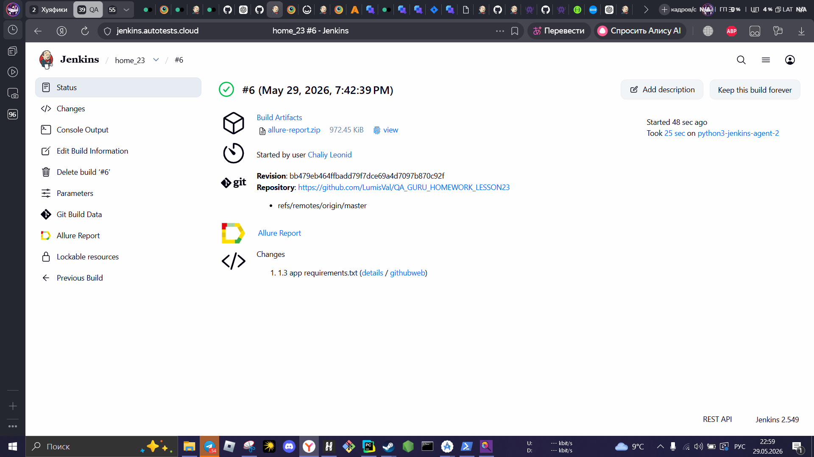
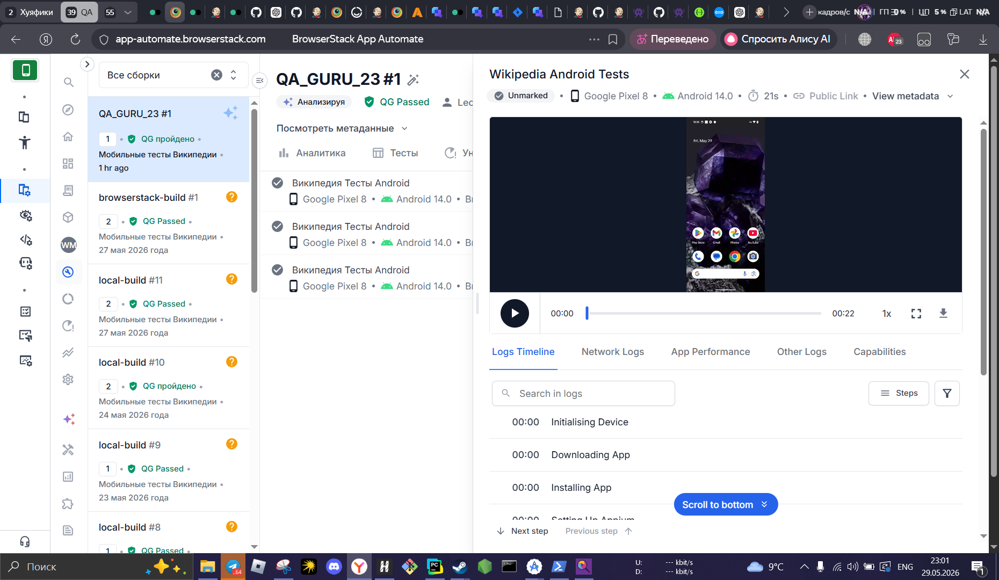
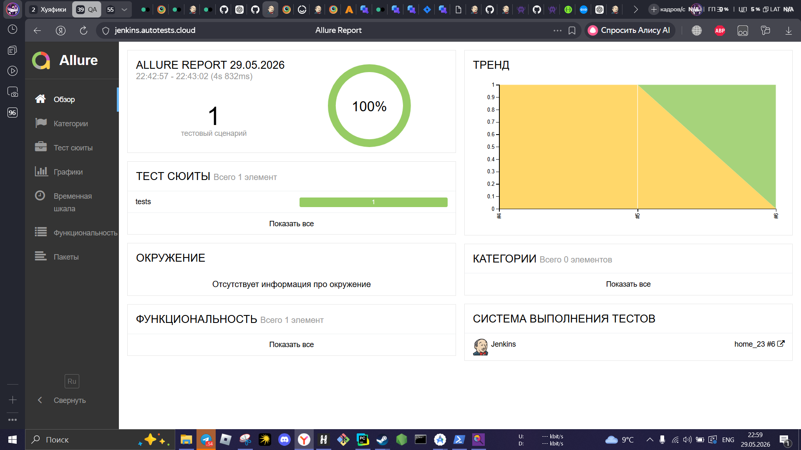
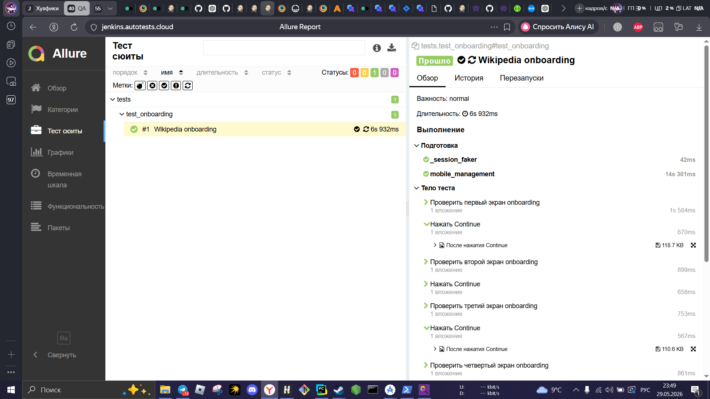

<p align="center">
  
</p>

# Mobile Automation Project

Автоматизация мобильного приложения Wikipedia с использованием Appium, Selene, Pytest и BrowserStack.

---

## Технологический стек

<p align="center">


</p>

---

## Что проверяется

Проект содержит UI тесты мобильного приложения Wikipedia.

Реализованы проверки:

- прохождение onboarding экрана
- проверка каждого шага onboarding
- работа на Android Emulator
- работа на реальном Android устройстве
- работа в BrowserStack

---

## Реализованные контексты

В проекте используется загрузка конфигурации через `python-dotenv`.

Доступны следующие окружения:

| Context | Описание |
|----------|----------|
| local_emulator | Android Emulator |
| local_real | Реальное Android устройство |
| bstack | BrowserStack Cloud |

---

## Структура проекта

```text
qa_home_23

├── app
├── config
├── pages
├── tests
├── utils
├── conftest.py
├── pytest.ini
├── requirements.txt
└── README.md
```

---

## Запуск тестов

### BrowserStack

```bash
set CONTEXT=bstack
pytest .
```

### Android Emulator

```bash
set CONTEXT=local_emulator
pytest .
```

### Real Device

```bash
set CONTEXT=local_real
pytest .
```

---

## Jenkins

Сборка проекта выполняется в Jenkins.

### Jenkins Job



---

## BrowserStack

Запуск тестов в облаке BrowserStack.

### BrowserStack Dashboard



---

## Allure Report

Отчёт формируется автоматически после выполнения тестов.

### Overview



---

## Видео выполнения теста

### BrowserStack Session



---

## Команда для генерации отчёта

```bash
allure serve allure-results
```

---

## Автор

Леонид Чалый

QA.GURU Mobile Automation